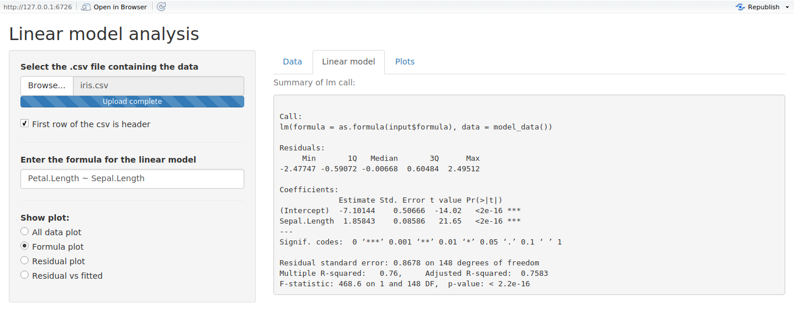

```{r setup, include=FALSE}
knitr::knit_hooks$set(file = function(before, options, envir) {
    if (before) {
      # paste0('<div class="panel panel-default"><div class="panel-heading">',
      #        options$name,
      #        '</div><div class="panel-body">')
      paste0('<ul class="nav nav-tabs"><li class="active"><a class="fname">',
             options$name,
             '</a></li></ul>')
    } else {
      # '</div></div>'
    }
})

knitr::opts_chunk$set(echo = TRUE, eval = FALSE)
```

# Šta je Shiny i čemu služi?

Kao što i [zvaničan sajt](https://shiny.rstudio.com/) kaže, Shiny je R paket koji omogućava pravljenje interaktivnih veb aplikacija direktno kroz R na izuzezno jednostavan način. 

On nam, u suštini, pruža mogučnost da bez znanja veb programiranja, koristeći samo R, napravimo grafički interfejs (u vidu veb aplikacije) za analize koje vršimo kroz R. Rezultat toga mogu biti vrlo upečatljivo prezentovani rezultati nekih analiza podataka, kao što se može videti na primerima u [Shiny galeriji](https://shiny.rstudio.com/gallery/).

Takodje, često imamo neke procedure koje iznova ponavljamo radeći u R-u, koje bismo možda želeli da automatizujemo na neki način. To se lepo rešava koristeći Shiny, budući da možemo napraviti grafički interfejs za te procedure, tako da nam bude dovoljno samo da zadamo neophodne ulaze, a izlaz se sam pojavi na ekranu.

U ovom tutorijalu ćemo uraditi zadatak sličan tome.

---------------------------------

# Linearni modeli

Kada radimo sa linearnim modelima, obično pratimo sledeći niz koraka:

1. Učitamo podatke
2. Odaberemo zavisne i nezavisne promenljive i napišemo ih kroz "formulu"...
3. ...koju prosledimo funkciji `lm` da bismo dobili model
4. Pogledamo `summary` modela
5. "Plotujemo"" reziduale i proveravamo uslove Gaus-Markova itd.
6. Ako nešto nije u redu, vratimo se na 2. i radimo ispočetka ostale korake

Može postati dosadno kucati jedne te iste funkcije u terminal, pa bismo želeli da ovaj proces svedemo samo na korake 1. i 2., koji zahtevaju naše razmišljanje.

Lep način da to uradimo je upravo da napravimo jednu blistavu veb aplikaciju! U njoj ćemo dati fajl koji sadrži podatke, odabrati formulu koja odredjuje zavisne i nezavisne promenljive i pustiti da Shiny odrati ostali posao i prikaže nam `summary` i grafike, na osnovu kojih dalje menjamo formulu i pratimo rezultate.

---------------------------

# Shiny aplikacija
Pokrenimo Rstudio i napravimo novi Shiny projekat (`File > New project > New directory > Shiny Web Application > [odaberite lokaciju]`). Shiny nam u odabranom direktorijumu napravi dva fajla: `ui.R` i `server.R`. Prvi fajl nam služi da definišemo elemente koje ćemo imati na stranici i njihovu vizuelnu strukturu, a u drugom ćemo definisati samo ponašanje aplikacije i sve što se dogadja u pozadini, tj. srž same aplikacije. Ova arhitektura koju prati Shiny je jako lepa, jer odvaja sam izgled aplikacije od njene suštine, tj. ponašanja.

Prvo ćemo početi od izgleda i definisanja vizuelnih elemenata aplikacije.

## Grafički Interfejs

Dakle, za našu aplikaciju potrebno je da imamo kao ulaz jedan (.csv) fajl koji sadrži podatke i formulu koja definiše model, a izlaz će nam biti `summary` i grafici. Shiny nam sam pri kreiranju projekta sam napravi jednostavnu aplikaciju koja prikazuje histogram podataka "Old Faithful"  gejzira, i može poslužiti kao šablon za korišćenje. Mi ćemo napraviti sve ispočetka, ali primetimo da nam je Shiny u okviru te aplikacije ponudio `sidebarLayout` kao moguć raspored elemenata. Ovo podrazumeva raspored stranice u obliku nalik na sledeći:

<center></center>

Znači, imamo naslov, sa leve strane su nam grupisani ulazi a sa desne izlazi. Ovaj raspored nama potpuno odgovara, kao i većini aplikacija koje bismo napravili, pa ćemo se odlučiti za njega.

Ako ne bismo želeli da koristimo ovaj raspored, pravili bismo raspored "po mreži", slično tabelama, zadavali bismo redove u kojima bi bili elementi, a kolonama bismo odredjivali njihov raspored unutar reda, kao i njihovu širinu. Ovaj model je prilično fleksibilan i u čestoj upotrebi je u veb dizajnu. Više informacija od mogučim rasporedima veb aplikacija možete naći na dokumentaciji: [Shiny: Application Layout Guide](http://shiny.rstudio.com/articles/layout-guide.html).

Da se vratimo na našu aplikaciju.

Uočavamo sledeće elemente na stranici:

* Naslov (Linear model analysis)
* "Sidebar" panel sa ulazima
* Glavni panel sa izlazom

To je prvo što ćemo definisati u `ui.R`:

```{r file=TRUE, name="ui.R"}
library(shiny)

shinyUI(fluidPage(
  # Application title
  titlePanel("Linear model analysis"),

  sidebarLayout(
    sidebarPanel(
    ),
    
    mainPanel(
    )
  )
))
```

Kreiranje korisničkog interfejsa počinjemo pozivanjem funkcije `shinyUI`, i prvim argumentom definišemo tip stranice, o kome možete pročitati na pomenutom linku [Shiny: Application Layout Guide](http://shiny.rstudio.com/articles/layout-guide.html). Mi se sada nećemo osvrtati na to i koristićemo `fluidPage`, koji je dovoljan za većinu primena.

Ostatak koda definiše sam raspored elemenata. U Shiny aplikacijama interfejs se slaže kao kockice, koristeći komponente koje predstavljaju elemente stranice poput naslova, panela, raznih ulaznih i izlaznih elemenata. Spisak dostupnih komponenti se može naći na [Shiny: Function Reference](https://shiny.rstudio.com/reference/shiny/latest/).

Prvo nam treba naslov, koji definišemo sa `titlePanel`. Posle toga dodajemo pomenuti `sidebarLayout`, koji zapravo predstavlja specijalnu komponentu koja sadrži dva elementa:

1. `sidebarPanel` koji sadrži ulazne komponente aplikacije
2. `mainPanel` u kome se nalaze izlazne komponente.

Ovim kodom smo definisali kostur aplikacije, sličan ovome (osenčili smo ono što predstavlja `sidebarLayout` komponenta):

<center></center>

Sada je na redu da definišemo ulaze i izlaze aplikacije. Za početak ćemo uzeti samo fajl i formulu kao ulaz, a za izlaz ćemo staviti `summary` modela.

```{r file=TRUE, name="ui.R"}
library(shiny)

shinyUI(fluidPage(
  # Application title
  titlePanel("Linear model analysis"),

  sidebarLayout(
    sidebarPanel(
      fileInput("data_file", "Select the .csv file containing the data",
        accept = c(
          "text/csv",
          "text/comma-separated-values,text/plain",
          ".csv")
      ),
      checkboxInput("header", "First row of the csv is header", TRUE),
      hr(), # linija koja odvaja ulaze, kao \hline u LaTeX-u
      textInput("formula", "Enter the formula for the linear model",
                placeholder = "e.g. y ~ x + log(x)")
    ),
    
    mainPanel(
      helpText("Summary of lm call:"),
      verbatimTextOutput("lm_summary", placeholder = TRUE)
    )
  )
))
```

Trebalo bi da je očigledno šta koja komponenta znači. Imamo ulaz za fajl, jedno polje za potvrdu, koje nam označava da li je prvi red .csv fajla zaglavlje, i tekstualno polje za formulu koju ćemo proslediti funkciji `lm`. Na izlazu imamo `helpText` koji nam je prosto pomoćni tekst, kao naslov iznad kontrole `verbatimTextOutput` koja nam predstavlja tekstualni izlaz, ali u istom obliku u kom ga izbacuje R prilikom `print` funkcije, bez ikakvog formatiranja.

Sve komponente i detalji u vezi sa argumentima koje primaju se mogu naći na [Shiny: Function Reference](https://shiny.rstudio.com/reference/shiny/latest/). Filter za .csv fajlove je preuzet odatle, iz dokumentacije za `fileInput`.

Ono što treba primetiti je osnovna struktura svih funkcija koje predstavljaju ulazne i izlazne komponente. Naime svaka od funkcija koje predstavljaju ulazne i izlazne komponente (Uglavnom oblika `*Input` ili `*Output`) kao prvi argument uzima string koji treba da bude jedinstven indikator te komponente, na osnovu kog se referiše na vrednost te komponente u serverskom kodu. Funkcije koje predstavljaju ulaze obično primaju kao drugi argument `label` koji govori koji tekst da se napiše pored same komponente.

Sada smo uradili dovoljno da bismo počeli da implementiramo osnovnu funkcionalnost aplikacije - da generišemo model i izbacimo `summary`.

## Serverska strana

Šta konkretno treba da uradimo sa strane servera da imamo neku funkcionalnost naše aplikacije?

1. Da učitamo fajl koji sadrži podatke i uzmemo njegovu lokaciju
2. Da učitamo u R date podatke koristeći funkiju `read.csv`
3. Da nad tim podacima pozovemo `lm` koristeći formulu sa ulaza
4. Da u izlazno polje `verbatimTextOutput("lm_summary")` ispišemo `summary` modela.

To se može izvesti sledećim kodom u fajlu `server.R`:

```{r file=TRUE, name="server.R"}
library(shiny)

shinyServer(function(input, output) {
  output$lm_summary <- renderPrint({
    inFile <- input$data_file
    if (is.null(inFile))
      return(NULL)
    
    model_data <- read.csv(inFile$datapath, input$header)
    
    model <- lm(as.formula(input$formula), data = model_data)
    summary(model)
  })
})
```

Serverski deo aplikacije počinje pozivom `shinyServer(function(input, output) {...})`, gde vidimo da koristimo argumente `input` i `output` za serverski kod. Te dve promenljive sadrže sve što nam je potrebno da bismo koristili ulazne i izlazne komponente koje smo definisali u `ui.R` i predstavljaju vezu izmedju `server.R` i `ui.R`.

Da bismo definisali kako će se ponašati izlazne komponente koristimo "render funkcije"(deo "Render Functions" u [Shiny: Function Reference](https://shiny.rstudio.com/reference/shiny/latest/)) i one su oblika `render*()`.
Mi izlaznoj komponenti (u našem slučaju `output$lm_summary`) *dodeljujemo* vrednost odgovarajuće render funkcije za njen tip izlaza (u ovom slučaju `renderPrint` jer želimo tekst u izvornom obliku kako ga štampa R) i unutar render funkcije pišemo kod koji definiše samo ponašanje. Taj kod treba da vrati (putem `return()` funkcije ili poslednje linije) rezultat koji želimo da bude prikazan u izlaznoj komponenti.

U našem slučaju kod je prilično jednostavan. Postavimo promenljivu `inFile` na vrednost `input$data_file` koja sadrži podatke of ulaznom fajlu i ako taj fajl postoji iščitamo podatke iz tog fajla pozivom `model_data <- read.csv(inFile$datapath, input$header)`. Primetimo da smo koristili polje `input$header` da bismo rekli R-u da li da tumači prvu liniju kao zaglavlje. Na kraju samo napravimo model pomoću `lm(as.formula(input$formula), data = model_data)` gde smo formulu sa ulaza pretvorili iz stringa u R objekat tipa `formula` i vratili `summary(model)` kao rezultat.

Sada možemo da pokrenemo aplikaciju klikom na dugme `▶ Run App` i vidimo kako radi.

Od trenutka kada učitamo fajl, prilikom svake promene teksta u polju za formulu, server iznova pokreće kod unutar `renderPrint` i pravi model, pa štampa izlaz ako je moguće, mmada češće štampa greške zbog nekompletne formule. To može da se reši uvodjenjem dugmeta koje će sprečiti modeliranje dok se ne pritisne ili mnogim proverama da li je sve učitano pre modelovanja, ali to zapravo i nije toliki problem za sada.

### Reaktivnost

Jedna od največih prednosti Shiny-ja je ta interaktivnost i utiska da se sve menja istog trenutka kako nešto promenimo - server reaguje na svaki naš ulaz u trenutku. To se i u Shiny zajednici naziva reaktivnošću (*Reactivity*). 

Reaktivnost se postiže upravo tako što pri svakoj promeni ulaza pozvanih u render funkcijama, iznova pokreće kod unutar tih funkcija. Zbog toga često može doči do problema ukoliko kod koji se izvršava nije previše brz. (Detaljan, lepo napisan opis reaktivnosti može se naći na [Shiny: Understanding reactivity](https://shiny.rstudio.com/articles/understanding-reactivity.html))

U našem slučaju mogući problem je u tome što unutar `renderPrint` iznova učitavamo priloženi fajl i pravimo model sa njim, što može biti jako neefikasno ukoliko je fajl velik. Stoga bismo želeli da nekako izbacimo učitavanje fajla iz `renderPrint` poziva i da ga učitamo u memoriju samo jednom - kad na aplikaciji odaberemo fajl sa podacima.

Prvo pada na pamet ideja da jednostavno uradimo sledeće:

```{r file=TRUE, name="~~server.R~~"}
library(shiny)

shinyServer(function(input, output) {
  inFile <- input$data_file
  if (is.null(inFile))
    return(NULL)
  
  model_data <- read.csv(inFile$datapath, input$header)
    
  output$lm_summary <- renderPrint({
    model <- lm(as.formula(input$formula), data = model_data)
    summary(model)
  })
})
```

Ali Shiny se žali! Javlja grešku <span style="color: red">`Operation not allowed without an active reactive context`</span>. Zbog čega se to javlja?

Ukratko, kod koji koristi promenljive `input` ili `output` se mora nalaziti unutar nekog reaktivnog okruženja. Možemo posmatrati kod koji pišemo u serveru kao da postoji u dva univerzuma: 

* Običnog R okruženja u kome imamo promenljive i funkcije koje smo sami definisali i mogu funkcionisati nezavisno od aplikacije i korisničkog ulaza u njoj.
* Reaktivnog univerzuma u kome se pozivamo na ulaze sa aplikacije i interagujemo sa aplikacijom.

Kod koji se pokreće unutar `render*` funkcija pripada reaktivnom univerzumu i zato nismo imali problema u prvobitnoj implementaciji.

Kako onda da rešimo naš problem? 

Na stranici [Shiny: An overview of reactivity](https://shiny.rstudio.com/articles/reactivity-overview.html) možemo naći rešenje.
Trik je da taj izraz koji smo izbacili iz `renderPrint` stavimo u neki novi reaktivni izraz, koji će isto pripadati reaktivnom univerzumu i koji može da se koristi ulazima. To postižemo jednostavnim ubacivanjem koda u `reactive({...})` funkciju i dobijenu vrednost skladištimo u promenljivu `model_data`.

```{r file=TRUE, name="server.R"}
library(shiny)

shinyServer(function(input, output) {
  model_data <- reactive({
    inFile <- input$data_file
    if (is.null(inFile))
      return(NULL)
    
    read.csv(inFile$datapath, input$header)
  })
  
  output$lm_summary <- renderPrint({
    model <- lm(as.formula(input$formula), data = model_data())
    summary(model)
  })
})
```

Ovde je bitno primetiti da je `model_data` sada funkcija, a ne statična promenljiva, i u `renderPrint` pozivu se sada koristi sa `model_data()` da bi se dobila konkretna vrednost. Pošto `model_data` od ulaza zavisi samo od `input$data_file`, vrednost koju vraća `model_data()` se neće menjati osim ako ne promenimo ulazni fajl. Time smo dobili ono što smo želeli - samo jednom čitamo podatke iz .csv fajla i koristimo ih u ostatku aplikacije bez ponovnog čitanja.

Takodje, možda je čudno što smo za sve funkcije koje koriste reaktivnost (`renderPrint`, `reactive`) koristili notaciju `({...})` za kod unutar njih. Regularno je koristiti i kod bez `{}` ukoliko nema više redova. Medjutim nije loše zadržati ovu konvenciju, da bismo i u kodu razlikovali ono što se dogadja u reaktivnom svetu naspram onoga što je "običan" R kod.

Sada imamo jednu funkcionalnu aplikaciju koja štampa osnovne informacije o modelu, bez viška računanja. Glavne principe pravljenja aplikacija smo prešli, pa će ostatak biti samo nadogradnja.

## Dodatna funkcionalnost

Sada ćemo implementirati ostatak željene aplikacije - generisaćemo grafike reziduala.

Prvo ćemo dodati kao ulaz jednu grupu za odabir željenog grafika pomoću `radioButtons` ulaza. Nudićemo grafik svih podataka, grafik reziduala, i grafik reziduala u odnosu na predvidjene vrednosti.

Takodje ćemo dodati `plotOutput` koji će sadržati grafike koje napravimo.

***Napomena. Od sada do kraja ćemo u kodu sa `...` označavati kod koji je ostao nepromenjen od prošle verzije fajla, da bismo izlaz držali što kraćim.***

```{r file=TRUE, name="ui.R"}
library(shiny)

shinyUI(fluidPage(
  # Application title
  titlePanel("Linear model analysis"),
  
  sidebarLayout(
    sidebarPanel(
      ...
      textInput("formula", "Enter the formula for the linear model",
                placeholder = "e.g. y ~ x + log(x)"),
      hr(),
      radioButtons("plot_choice", "Show plot:",
                   c("All data plot" = "all_data",
                     "Residual plot" = "resid",
                     "Residual vs fitted" = "resvfit"))
    ),
    
    mainPanel(
      helpText("Summary of lm call:"),
      verbatimTextOutput("lm_summary", placeholder = TRUE),
      helpText("Plot:"),
      plotOutput("plots", height = 600)
    )
  )
))
```

Sada treba i u serverskom kodu dodati traženu funkcionalnost. Samo ćemo na osnovu odabranog grafika (`input$plot_choice`) pokrenuti različite komande za prikazivanje. Koristićemo ugradjenu funkciju [`switch`](https://www.rdocumentation.org/packages/base/versions/3.4.1/topics/switch) za to.

```{r file=TRUE, name="server.R"}
library(shiny)

shinyServer(function(input, output) {
  model_data <- reactive({ ... })
  
  output$lm_summary <- renderPrint({ ... })
  
  output$plots <- renderPlot({
    m <- lm(as.formula(input$formula), data = model_data())
    switch(input$plot_choice,
           all_data = plot(model_data()),
           resid = plot(m$residuals),
           resvfit = plot(m$residuals ~ m$fitted.values))
  })
})
```

Vidimo da dva puta, i za grafike i za `summary`, iznova generišemo model, pa bismo i to voleli da izdvojimo u jedan zaseban poziv. Opet ćemo se osloniti na `reactive({...})`. Da bismo suzbili stalne greške koje vidjamo zbog nedefinisanog modela, okružićemo poziv `lm` sa funkcijom `tryCatch`. Opet primetimo da `model` gledamo kao funkciju i vrednost uzimamo sa `model()`.

```{r file=TRUE, name="server.R"}
library(shiny)

shinyServer(function(input, output) {
  model_data <- reactive({ ... })
  
  model <- reactive({
    if (is.null(model_data()))
      return(NULL)
    
    tryCatch(lm(as.formula(input$formula), data = model_data()),
             error = function(e) return(NULL))
  })
  
  output$lm_summary <- renderPrint({
    if (is.null(model()))
      return(NULL)
    
    summary(model())
  })
  
  output$plots <- renderPlot({
    if (is.null(model()))
      return(NULL)
    
    m <- model()
    switch(input$plot_choice,
           all_data = plot(model_data()),
           resid = plot(m$residuals),
           resvfit = plot(m$residuals ~ m$fitted.values))
  })
})
```

Imamo željenu funkcionalnost!

Možda ne bi bilo zgoreg i da štampamo sumarne statistike od samih podataka, da ne radimo baš na slepo. To nam je sada već trivijalno. Dodamo jedan izlaz u `ui.R`:

```{r file=TRUE, name="ui.R"}
library(shiny)

shinyUI(fluidPage(
  # Application title
  titlePanel("Linear model analysis"),
  
  sidebarLayout(
    sidebarPanel( ... ),
    
    mainPanel(
      helpText("Summary of the data:"),
      tableOutput("data_summary"),
      ...
    )
  )
))
```

... i serverski kod:

```{r file=TRUE, name="server.R"}
library(shiny)

shinyServer(function(input, output) {
  model_data <- reactive({ ... })
  
  model <- reactive({ ... })
  
  output$data_summary <- renderTable({
    if(is.null(model_data()))
      return(NULL)
    
    as.data.frame.matrix(summary(model_data()), row.names = FALSE)
  })
  
  output$lm_summary <- renderPrint({ ... })
  
  output$plots <- renderPlot({ ... })
})
```

Uradićemo još samo jednu izmenu interfejsa. Imamo tri stvari koje prikazujemo na izlazu, pa nam već izlazi sa ekrana. Lepše bi bilo da svaki izlaz ima zasebnu karticu. Srećom to je veoma jednostavno uraditi uz Shiny, koristeći se komponentama `tabsetPanel` i `tabPanel`. Vršimo promenu samo na `ui.R`.


```{r file=TRUE, name="ui.R"}
library(shiny)

shinyUI(fluidPage(
  # Application title
  titlePanel("Linear model analysis"),
  
  sidebarLayout(
    sidebarPanel( ... ),
    
    mainPanel(
      tabsetPanel(
        tabPanel("Data",
          helpText("Summary of the data:"),
          tableOutput("data_summary")
        ),
        tabPanel("Linear model",
          helpText("Summary of lm call:"),
          verbatimTextOutput("lm_summary", placeholder = TRUE)
        ),
        tabPanel("Plots",
          helpText("Plot:"),
          plotOutput("plots", height = 600)
        )
      )
    )
  )
))
```

## Konačna aplikacija i kod

Sada već imamo jednu funkcionalnu i skockanu aplikaciju! Izgleda ovako:

<center></center>

Kompletan kod interfejsa i servera je u nastavku.

```{r file=TRUE, name="ui.R"}
library(shiny)

shinyUI(fluidPage(
  # Application title
  titlePanel("Linear model analysis"),
  
  sidebarLayout(
    sidebarPanel(
      fileInput("data_file", "Select the .csv file containing the data",
                accept = c(
                  "text/csv",
                  "text/comma-separated-values,text/plain",
                  ".csv")
      ),
      checkboxInput("header", "First row of the csv is header", TRUE),
      hr(), # linija koja odvaja ulaze, kao \hline u LaTeX-u
      textInput("formula", "Enter the formula for the linear model",
                placeholder = "e.g. y ~ x + log(x)"),
      hr(),
      radioButtons("plot_choice", "Show plot:",
                   c("All data plot" = "all_data",
                     "Residual plot" = "resid",
                     "Residual vs fitted" = "resvfit"))
    ),
    
    mainPanel(
      tabsetPanel(
        tabPanel("Data",
          helpText("Summary of the data:"),
          tableOutput("data_summary")
        ),
        tabPanel("Linear model",
          helpText("Summary of lm call:"),
          verbatimTextOutput("lm_summary", placeholder = TRUE)
        ),
        tabPanel("Plots",
          helpText("Plot:"),
          plotOutput("plots", height = 600)
        )
      )
    )
  )
))
```

```{r file=TRUE, name="server.R"}
library(shiny)

shinyServer(function(input, output) {
  model_data <- reactive({
    inFile <- input$data_file
    if (is.null(inFile))
      return(NULL)
    
    read.csv(inFile$datapath, input$header)
  })
  
  model <- reactive({
    if (is.null(model_data()))
      return(NULL)
    
    tryCatch(lm(as.formula(input$formula), data = model_data()),
             error = function(e) return(NULL))
  })
  
  output$data_summary <- renderTable({
    if(is.null(model_data()))
      return(NULL)
    
    as.data.frame.matrix(summary(model_data()), row.names = FALSE)
  })
  
  output$lm_summary <- renderPrint({
    if (is.null(model()))
      return(NULL)
    
    summary(model())
  })
  
  output$plots <- renderPlot({
    if (is.null(model()))
      return(NULL)
    
    m <- model()
    switch(input$plot_choice,
           all_data = plot(model_data()),
           resid = plot(m$residuals),
           resvfit = plot(m$residuals ~ m$fitted.values))
  })
})
```

-------------------------

# Objavljivanje i deljenje aplikacija

Kada napravite aplikaciju, nekad je potrebno i da je podelite sa drugima ili jednostavno postavite na internet da biste je i vi lakše koristili, sa bilo kog uredjaja. Najlakši način za to je putem veb sajta [shinyapps.io](http://www.shinyapps.io/). Postoji besplatan paket koji daje dovoljno resursa za neke lične projekte koji neće biti mnogo korišćeni.

Nema potrebe ulaziti u previše detalja oko postupka postavljanja aplikacije na internet, budući da je sve jednostavno predjeno u [dokumentaciji](http://docs.rstudio.com/shinyapps.io/getting-started.html). Potrebno je podesiti `rsconnect` paket da se poveže sa sajtom i uraditi `deploy()`, što je sve objašnjeno u dokumentaciji, ili pritisnuti `Publish` dugme u RStudiu (plavo dugme pored `Run`). Pomenuo bih samo da je možda potrebno instalirati najnoviju verziju paketa, kao što piše, sa

```{r}
if(!require("devtools"))
  install.packages("devtools")
devtools::install_github("rstudio/rsconnect")
```

budući da sam ja imao nekih problema sa verzijom sa CRAN-a, ali je možda to i popravljeno.

Aplikacija koju smo u ovom tutorijalu napravili je objavljena i nalazi se na https://blaza.shinyapps.io/matf_lma .

---------------------------

# Korisni linkovi

* [Shiny: Function Reference](https://shiny.rstudio.com/reference/shiny/latest/) - Sve funkcije unutar paketa Shiny i njhova dokumentacija

* [Shiny: Tutorial](https://shiny.rstudio.com/tutorial/) - zvaničan tutorijal o Shiny-ju, nešto opširniji od ovog i pokriva još neke značajne teme poput bolje kontrole reaktivnosti i stilizovanja aplikacije čega se mi nismo dotakli.

* [Shiny: Articles](https://shiny.rstudio.com/articles/) - Kolekcija vrlo lepo napisanih i korisnih članaka koji opisuju principe rada paketa i daju česte primere korišćenja. Veliki deo informacija korišćenih za ovaj tutorijal potiču upravo iz ovih članaka. Već smo pomenuli neke od njih:
  
  * [Shiny: Application Layout Guide](http://shiny.rstudio.com/articles/layout-guide.html) - uputstvo za struktuiranje izgleda aplikacije i primeri nekih rasporeda.
  * [Shiny: An overview of reactivity](https://shiny.rstudio.com/articles/reactivity-overview.html) - osnovni opis reaktivnosti i kako je koristiti
  * [Shiny: Understanding reactivity](https://shiny.rstudio.com/articles/understanding-reactivity.html) - detaljan opis funkcionisanja reaktivnosti

---------------------------
